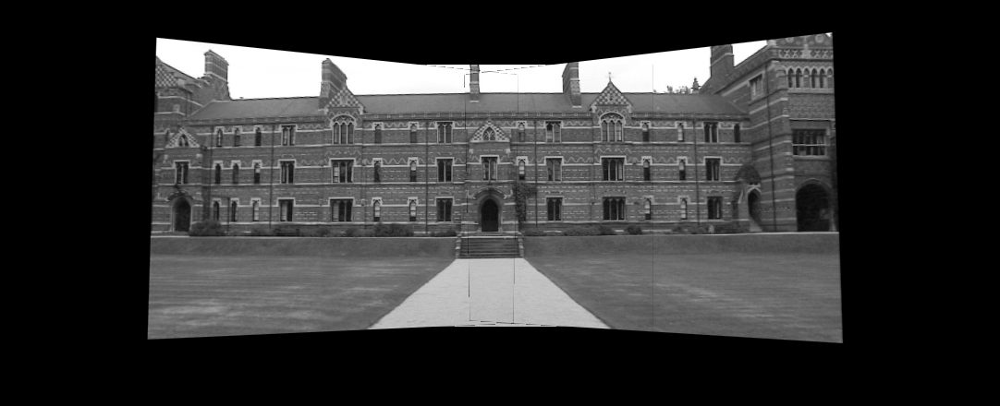

<p align="center">
  <h1 align="center">panorama</h1>
</p>

<p align="center">
    
</p>

> Create a single panoramic image by stitching a set of photographs

### Clone
- Clone this repo to your local machine using `https://github.com/gurveerdhindsa/panorama.git`

### Run
```
python panoramic_image.py
```

##  Support
- Website at <a href="https://gurveerdhindsa.ca" target="_blank">`gurveerdhindsa.ca`</a>